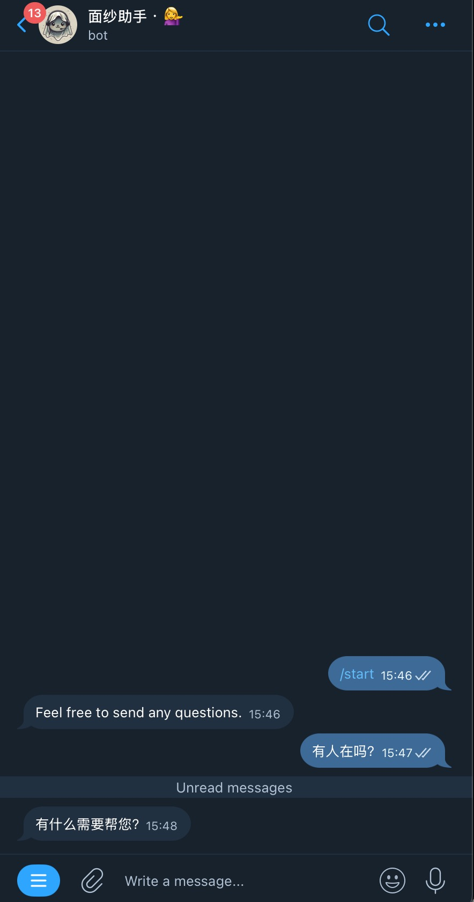
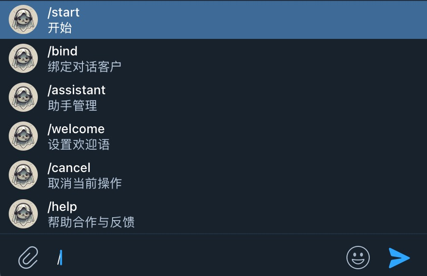

# VeilPassBot — Telegram Two-Way Customer Service Relay System
<div align="center">
A customer service relay bot designed specifically for Telegram, used to build a secure, collaborative, and manageable two-way communication channel between **users ↔ support team**.

Suitable for: customer support, anonymous contact, after-sales service, channel inquiries, and private communications.


https://t.me/VeilPassBot?start=start

[@VeilPassBot](https://t.me/VeilPassBot?start=start)

</div>


## 🌍 Language

- 🇨🇳 [中文](./README.md)
- 🇺🇸 English (current)


---

## 🚀 Why Do You Need It?

Using personal Telegram accounts for customer support often leads to these problems:

- Multiple agents need to share one entry point
- You don’t want to expose real personal accounts
- Conversations become messy and hard to assign
- Customer messages are easily missed
- No permission control
- Switching between multiple accounts is inefficient

VeilPassBot solves these issues with **message relay + session routing + assistant collaboration mechanisms**.

---

## 🧩 Core Capabilities

### ✅ Two-Way Message Relay
User messages → automatically forwarded to support  
Agent replies → automatically sent back to the user  

No copy-paste needed.

---

### ✅ Multi-Agent Collaboration
- Multiple assistants can work simultaneously
- Sessions can be assigned
- Sessions can be taken over
- Team collaborative replies supported

---

### ✅ Privacy Protection
- Support agents’ real accounts are hidden
- Users only see the bot
- Supports anonymous communication scenarios

---

### ✅ Session Management
- Independent session per user
- Sessions are traceable
- Extendable with tags/status systems

---

### ✅ Broadcast Capability
Send messages to previously contacted users:

- Announcements
- Notifications
- Updates
- Campaign messages

---

## 🏗 Use Cases

### Customer Support System
- Product after-sales
- Technical support
- Ticket entry point

---

### Anonymous Contact Channel
- Reporting channel
- Suggestion box
- Business contact

---

### Community / Channel Operations
- Fan private message entry
- Business inquiries
- Partnership requests

---

### Global / Cross-Border Business
- Telegram private support
- Overseas customer communication
- Automated relay support

---

## ⚙️ Workflow Overview

```
User
↓
Your Bot 👈 VeilPassBot
↓
Support Team / Assistants
```


Messages are synchronized in both directions automatically — no manual forwarding required.

---

## 🛠 Design Goals

- Minimal setup
- No complex backend required
- Low learning curve
- Horizontally scalable
- Self-hostable
- Secondary development friendly

---

## 📦 Target Users

- SaaS developers
- Telegram operators
- Global business teams
- Support teams
- Indie developers
- Community managers

---

## 🔒 Security

- No sensitive chat storage (optional strategy)
- Self-hosting supported
- Permission control supported
- Access restriction supported

---

## 🚀 Quick Start

Try it here: https://t.me/VeilPassBot?start=start @VeilPassBot

### Customer View



### Admin Or Assistant View


